<div align="center">

# HR PRO — เอกสารการออกแบบระบบ
### System Design Document · HRIS สำหรับองค์กรขนาดกลาง (40–200 คน)

<br/>


<br/>

*เอกสารฉบับนี้อธิบายสถาปัตยกรรม แบบจำลองข้อมูล กระบวนการทางธุรกิจ ระบบความปลอดภัย และระบบดีไซน์ของ HR PRO อย่างเป็นทางการ*
*แผนภาพทั้งหมดวาดด้วย **[Mermaid](https://mermaid.js.org/)** — เครื่องมือไดอะแกรมโอเพนซอร์สที่ฟรีและเรนเดอร์ได้ทันทีบน GitHub/GitLab/VS Code โดยไม่ต้องติดตั้งอะไรเพิ่ม*

🔗 **Live Demo:** <https://hr-pro-jqqx.onrender.com> · 📘 **คู่มือผู้ใช้/ติดตั้ง:** [README.md](README.md)

</div>

---

<table>
<tr><td>

**เอกสาร** Software Design Document (SDD) &nbsp;·&nbsp; **ระบบ** HR PRO — Human Resource Information System
**เวอร์ชัน** 1.0 &nbsp;·&nbsp; **ปรับปรุงล่าสุด** 21 มิถุนายน 2026 &nbsp;·&nbsp; **สถานะ** Approved / Living document
**ขอบเขต** สถาปัตยกรรมระบบ, Data Model, RBAC, Business Flows, Design System, การ Deploy
**กลุ่มเป้าหมาย** สถาปนิกซอฟต์แวร์, นักพัฒนา Backend/Frontend, ทีม QA, ผู้ตรวจประเมินระบบ

</td></tr>
</table>

---

## 📑 สารบัญ

1. [ภาพรวมระบบ (System Overview)](#1-ภาพรวมระบบ-system-overview)
2. [หลักการออกแบบ & เหตุผลเลือกเทคโนโลยี](#2-หลักการออกแบบ--เหตุผลเลือกเทคโนโลยี)
3. [สถาปัตยกรรมระบบ (System Architecture)](#3-สถาปัตยกรรมระบบ-system-architecture)
4. [แบบจำลองข้อมูล (Data Model / ERD)](#4-แบบจำลองข้อมูล-data-model--erd)
5. [ความปลอดภัย & การกำหนดสิทธิ์ (Security & RBAC)](#5-ความปลอดภัย--การกำหนดสิทธิ์-security--rbac)
6. [กระบวนการทางธุรกิจหลัก (Core Business Flows)](#6-กระบวนการทางธุรกิจหลัก-core-business-flows)
7. [แผนผังโมดูล & เส้นทาง (Module & Routing Map)](#7-แผนผังโมดูล--เส้นทาง-module--routing-map)
8. [ระบบดีไซน์ (Design System)](#8-ระบบดีไซน์-design-system)
9. [คุณภาพ & การทดสอบ (Quality & Testing)](#9-คุณภาพ--การทดสอบ-quality--testing)
10. [ประสิทธิภาพ (Performance)](#10-ประสิทธิภาพ-performance)
11. [การนำขึ้นใช้งาน (Deployment & DevOps)](#11-การนำขึ้นใช้งาน-deployment--devops)
12. [แผนพัฒนาต่อ (Roadmap)](#12-แผนพัฒนาต่อ-roadmap)
13. [ภาคผนวก (Appendix)](#13-ภาคผนวก-appendix)

---

## 1. ภาพรวมระบบ (System Overview)

**HR PRO** คือระบบสารสนเทศบุคคล (HRIS) แบบ on-premise/cloud สำหรับองค์กรขนาด **40–200 คน** เน้นการใช้งานจริงในสไตล์ **Corporate มืออาชีพ** สร้างด้วย **PHP Laravel + MySQL** เรนเดอร์ฝั่งเซิร์ฟเวอร์ด้วย Blade และ **Design System ที่เขียนเองทั้งหมด** (ปราศจากขั้นตอน build ฝั่ง Node)

### 1.1 วัตถุประสงค์ & ขอบเขต

| มิติ | รายละเอียด |
|---|---|
| **เป้าหมายธุรกิจ** | รวมศูนย์ข้อมูลพนักงาน, โครงสร้างองค์กร, การลา, การลงเวลา และการสื่อสารภายในไว้ในระบบเดียว |
| **ผู้ใช้งาน** | 4 บทบาท — Super Admin, HR Manager, Manager, Employee |
| **โหมดการทำงาน** | Web application เรนเดอร์ฝั่งเซิร์ฟเวอร์ (Multi-Page App), session cookie |
| **นอกขอบเขต (MVP)** | Payroll, Recruitment, Performance review, การส่งออก PDF/Excel (ดู [§12 Roadmap](#12-แผนพัฒนาต่อ-roadmap)) |

### 1.2 คุณสมบัติเชิงระบบ (Non-Functional Requirements)

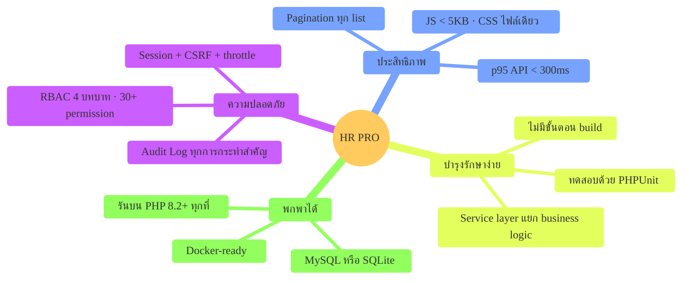

---

## 2. หลักการออกแบบ & เหตุผลเลือกเทคโนโลยี

> **ปรัชญาหลัก:** *"เรียบง่าย ติดตั้งได้ทันที ปลอดภัยโดยปริยาย และดูแลรักษาได้ในระยะยาว"*

| การตัดสินใจ | ทางเลือกที่เลือก | เหตุผล |
|---|---|---|
| **Framework** | Laravel `^12.0` *(บน PHP 8.2+, รัน 8.3 ใน Docker)* | Ecosystem ครบ (Eloquent, Validation, Auth, Queue) ทีมไทยคุ้นเคย โฮสต์ได้ทุกที่ |
| **การเรนเดอร์** | Server-rendered Blade | ไม่มี build step (no Node/Vite) · bundle เล็ก · LCP เร็ว · SEO/ความเรียบง่ายดีกว่าสำหรับระบบภายใน |
| **UI/Styling** | Design System เขียนเอง (CSS ไฟล์เดียว ~290 บรรทัด) | ไม่พึ่ง Tailwind/Bootstrap · ควบคุมธีมผ่าน CSS custom properties · ปลอด dependency |
| **Auth** | Session cookie (ไม่ใช่ JWT) | เหมาะกับเว็บภายในองค์กร · ปลอดภัยด้วย CSRF + HttpOnly cookie |
| **Authorization** | RBAC แบบ role→permission (many-to-many) + super-admin bypass | ยืดหยุ่น กำหนดสิทธิ์ราย permission ได้ · ตรวจที่ Gate กลาง |
| **Business logic** | Service layer (`app/Services`) | แยก logic ออกจาก Controller → ทดสอบหน่วยได้ · reuse ได้ |
| **ฐานข้อมูล** | MySQL 8 (prod) · SQLite (Docker/เดโม) · SQLite `:memory:` (test) | พกพาสูง · ไม่ต้องตั้ง DB แยกสำหรับเดโม |
| **ไดอะแกรมเอกสาร** | **Mermaid** | ฟรี · โอเพนซอร์ส · เรนเดอร์เป็นภาพอัตโนมัติบน GitHub/VS Code · เก็บเป็นข้อความใน Git (diff ได้) — สอดคล้องปรัชญา "ไม่มี build step" |

---

## 3. สถาปัตยกรรมระบบ (System Architecture)

### 3.1 ภาพรวมเชิงชั้น (Layered Architecture)

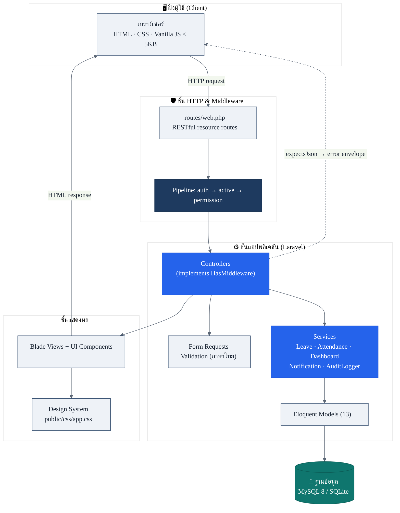

> *Controllers บางตัว (Dashboard, Profile, Notification, LeaveRequest, Attendance) ไม่มี permission middleware — อาศัยการ scope ข้อมูลภายใน controller + `abort_unless` เพื่อรองรับ self-service*

### 3.2 วงจรชีวิตของคำขอ (Request Lifecycle)

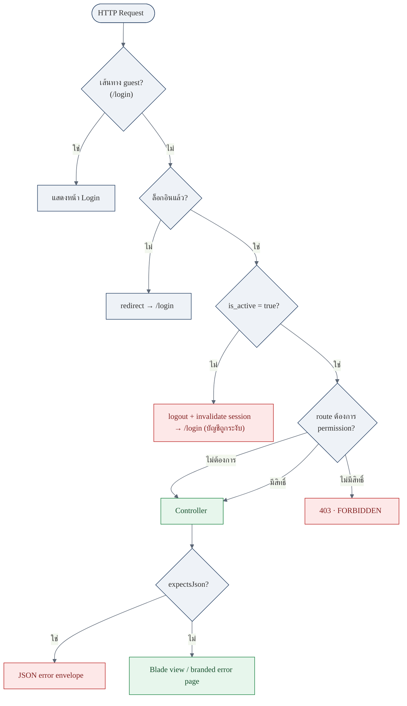

### 3.3 โครงสร้างโฟลเดอร์

```
hr-pro/
├── app/
│   ├── Http/
│   │   ├── Controllers/        # Dashboard, Employee, Department, Position, LeaveRequest,
│   │   │   ├── Auth/           #   LeaveApproval, Attendance, Announcement, Report, AuditLog …
│   │   │   └── Settings/       #   User, Role
│   │   ├── Middleware/         # EnsureUserHasPermission, EnsureUserIsActive
│   │   └── Requests/           # Form Request validation (ข้อความภาษาไทย)
│   ├── Models/                 # 13 Eloquent models
│   ├── Providers/              # AppServiceProvider, AuthServiceProvider (RBAC gate)
│   ├── Services/               # LeaveService, AttendanceService, DashboardService,
│   │                           #   NotificationService, AuditLogger  ← business logic
│   └── Support/helpers.php     # initials(), thb(), avatar_color()
├── bootstrap/app.php           # middleware aliases + error envelope (withExceptions)
├── config/hrpro.php            # โดเมนคอนฟิก (เวลางาน, per_page, รหัสพนักงาน …)
├── database/
│   ├── migrations/             # 16 migrations (เรียงลำดับ)
│   └── factories/ • seeders/   # RolePermissionSeeder, DemoDataSeeder
├── public/{css,js}/            # Design System (app.css) + vanilla app.js
├── resources/views/
│   ├── components/             # anonymous Blade UI kit (input, select, card, …)
│   ├── layouts/ • partials/    # app shell (sidebar/topbar) + guest layout
│   └── <module>/               # dashboard, employees, departments, … views
├── routes/web.php              # ทุก route (single source of truth)
├── tests/{Unit,Feature}/       # PHPUnit
└── Dockerfile · render.yaml    # การ deploy
```

---

## 4. แบบจำลองข้อมูล (Data Model / ERD)

ระบบมี **13 Eloquent models / 14 ตารางหลัก** + **2 pivot tables** (`role_user`, `permission_role`) + 1 ตาราง framework (`password_reset_tokens`)

### 4.1 Entity-Relationship Diagram

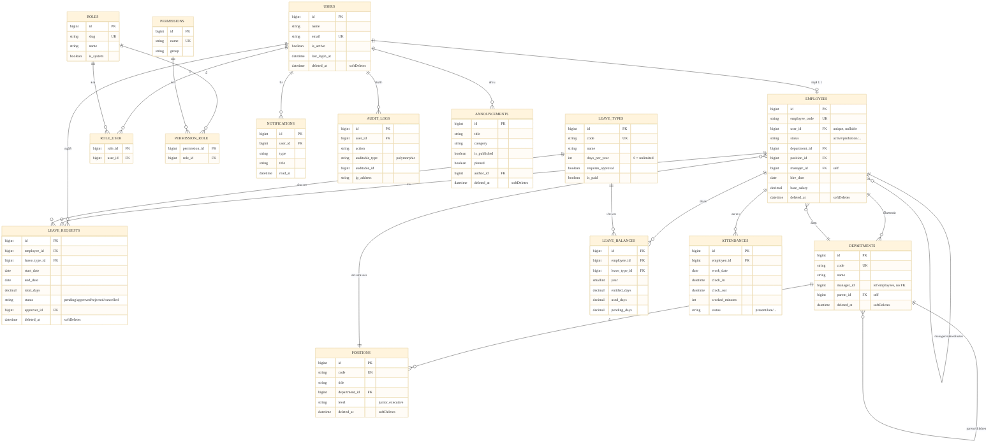

> **ข้อสังเกตการออกแบบ:**
> - `LEAVE_BALANCES` มี **unique composite** `(employee_id, leave_type_id, year)` และ `ATTENDANCES` มี `(employee_id, work_date)` เพื่อกันข้อมูลซ้ำระดับฐานข้อมูล
> - `remaining_days` ของ `LEAVE_BALANCES` เป็น **accessor คำนวณ** (`entitled − used − pending`) ไม่ใช่คอลัมน์จริง
> - `departments.manager_id` ชี้ไปยัง `employees` แต่ **ไม่มี FK constraint ระดับ DB** (โดยตั้งใจ เพื่อเลี่ยง circular dependency และให้ทดสอบบน SQLite ง่าย) — ความสัมพันธ์ Eloquent ยังทำงานปกติ
> - `AUDIT_LOGS` เป็น polymorphic แบบหลวม (`auditable_type` + `auditable_id`) แต่ไม่ได้นิยาม `morphTo()`

### 4.2 กลยุทธ์ Soft-delete

| ใช้ `softDeletes()` (กู้คืนได้ + รักษา referential history) | ลบจริง (Hard delete) |
|---|---|
| `users`, `employees`, `departments`, `positions`, `leave_requests`, `announcements` | `roles`, `permissions`, `leave_types`, `leave_balances`, `attendances`, `audit_logs`, `notifications`, pivots |

**FK delete behavior:** `cascadeOnDelete` บน pivot ทั้งสองและตารางอ้างอิงพนักงาน (leave_requests, leave_balances, attendances, notifications) · `nullOnDelete` บนความสัมพันธ์เชิงโครงสร้าง (department/position/manager/approver/author/parent)

---

## 5. ความปลอดภัย & การกำหนดสิทธิ์ (Security & RBAC)

### 5.1 การพิสูจน์ตัวตน (Authentication)

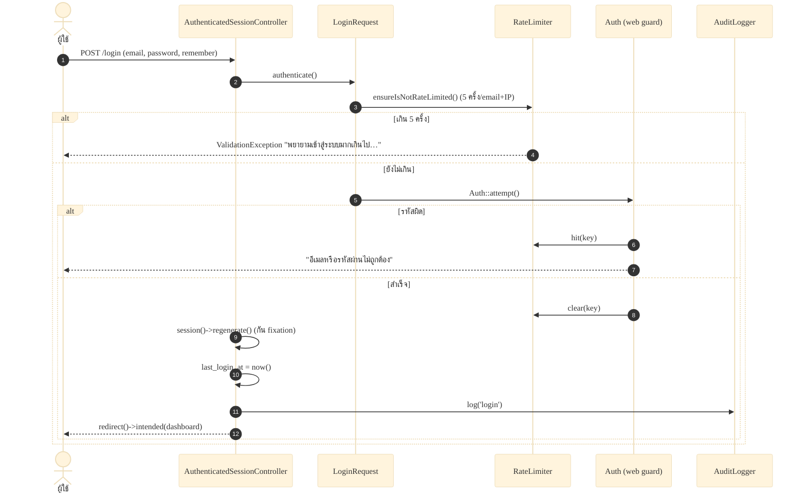

**มาตรการเสริม:**
- **Login throttle** — 5 ครั้ง/นาที ต่อคู่ `email + IP` (ยิง `Lockout` event เมื่อเกิน)
- **Account suspension** — ทุก request ที่ผ่าน middleware `active`: ถ้า `is_active = false` จะ **logout ทันที** + invalidate session + redirect พร้อมข้อความ *"บัญชีของคุณถูกระงับการใช้งาน…"*
- **Session security** — regenerate session ตอนล็อกอิน, invalidate + regenerate CSRF token ตอน logout, HttpOnly cookie + CSRF protection

### 5.2 โมเดลการกำหนดสิทธิ์ (RBAC)

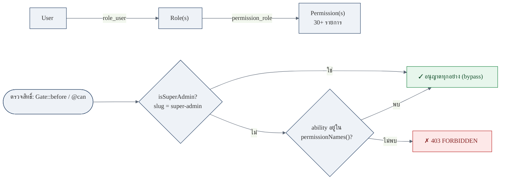

**กลไกบังคับใช้ (3 ชั้นประสานกัน):**
1. **Data model** — `User belongsToMany Role` → `Role belongsToMany Permission`
2. **Gate::before** (`AuthServiceProvider`) — super-admin คืน `true` ทันที; มิฉะนั้นถ้า ability มี `.` → `hasPermission()`
3. **Route enforcement** — แต่ละ Controller implement `HasMiddleware` คืน `Middleware('permission:<name>', only: [...])`; alias `permission` → `EnsureUserHasPermission` (abort 401 ถ้าไม่มี user, 403 ถ้าไม่มีสิทธิ์)

### 5.3 บทบาท & สิทธิ์ (Roles × Permissions Matrix)

| บทบาท (slug) | ชื่อ | System | จำนวนสิทธิ์ | สรุป |
|---|---|:---:|:---:|---|
| `super-admin` | ผู้ดูแลระบบสูงสุด | ✅ | **ทั้งหมด (`*`)** | bypass ทุกการตรวจสอบ |
| `hr-manager` | ผู้จัดการฝ่ายบุคคล | — | **22** | CRUD บุคลากร/แผนก/ตำแหน่ง/ประเภทลา + อนุมัติลา + ประกาศ + รายงาน + audit |
| `manager` | หัวหน้างาน | — | **6** | ดูพนักงาน, ดู/อนุมัติคำขอลา, ดูการลงเวลาทีม, รายงาน |
| `employee` | พนักงาน | ✅ | **0** | self-service เท่านั้น (ไม่ผ่าน permission gate) |

**กลุ่มสิทธิ์ (Permission groups):** `employees` · `departments` · `positions` · `leave-types` (กลุ่มละ view/create/update/delete) · `leave-requests.viewAll` · `leave-approvals` (view/approve) · `attendance.viewAll` · `announcements.manage` · `reports.view` · `audit-logs.view` · `users` · `roles` (กลุ่มละ view/create/update/delete)

> บทบาท `employee` ไม่ต้องมี permission ใด ๆ เพราะเส้นทาง self-service (dashboard, profile, คำขอลาของตน, ลงเวลา) ต้องการเพียง `auth + active`

### 5.4 รูปแบบ Error Envelope (API)

เมื่อร้องขอแบบ JSON/XHR (`expectsJson()`) ระบบตอบด้วยรูปแบบเดียวกันเสมอ (กำหนดใน `bootstrap/app.php` → `withExceptions`):

```json
{ "error": { "code": "VALIDATION_ERROR", "message": "…", "details": { } } }
```

| Exception | `code` | HTTP |
|---|---|:---:|
| ValidationException | `VALIDATION_ERROR` | 422 |
| AuthenticationException | `UNAUTHENTICATED` | 401 |
| AuthorizationException | `FORBIDDEN` | 403 |
| NotFound | `NOT_FOUND` | 404 |
| อื่น ๆ | `SERVER_ERROR` | 500 |

*คำขอที่ไม่ใช่ JSON จะ fall back ไปยังหน้า Blade error ที่มีแบรนด์*

---

## 6. กระบวนการทางธุรกิจหลัก (Core Business Flows)

### 6.1 การยื่นและอนุมัติคำขอลา (Leave Request)

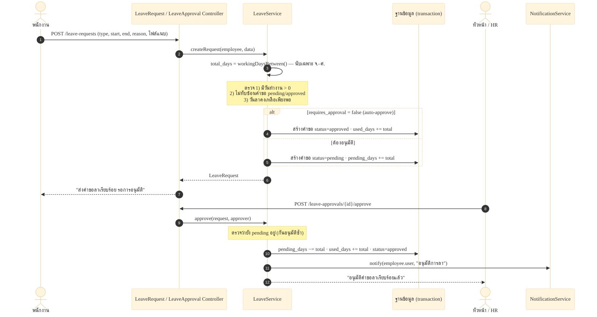

### 6.2 สถานะคำขอลา & การเคลื่อนยอดวันลา (State Machine)

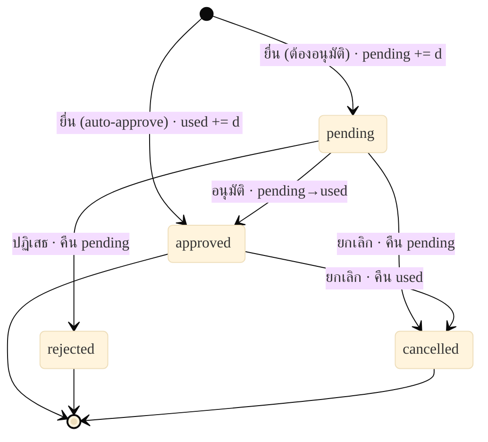

**ตรรกะยอดวันลา (LeaveBalance):** ทุก transition ทำใน `DB::transaction`; ค่าทุกตัว floored ที่ 0; `entitled_days` ตั้งครั้งเดียวตอนสร้างจาก `days_per_year` และไม่ถูกหักทอน

| เหตุการณ์ | `pending_days` | `used_days` |
|---|---|---|
| ยื่น (ต้องอนุมัติ) | `+= total` | — |
| ยื่น (auto-approve) | — | `+= total` |
| อนุมัติ | `−= total` | `+= total` |
| ปฏิเสธ | `−= total` | — |
| ยกเลิก (ขณะ pending) | `−= total` | — |
| ยกเลิก (ขณะ approved) | — | `−= total` |

**กฎการตรวจสอบสำคัญ:** ช่วงวันต้องมีวันทำงาน > 0 · ห้ามทับซ้อนคำขอ `pending/approved` · ถ้า `days_per_year > 0` ต้องมีวันคงเหลือพอ (`days_per_year = 0` = ไม่จำกัด) · อนุมัติ/ปฏิเสธได้เฉพาะคำขอที่ยัง `pending`

### 6.3 การลงเวลาเข้า–ออกงาน (Attendance)

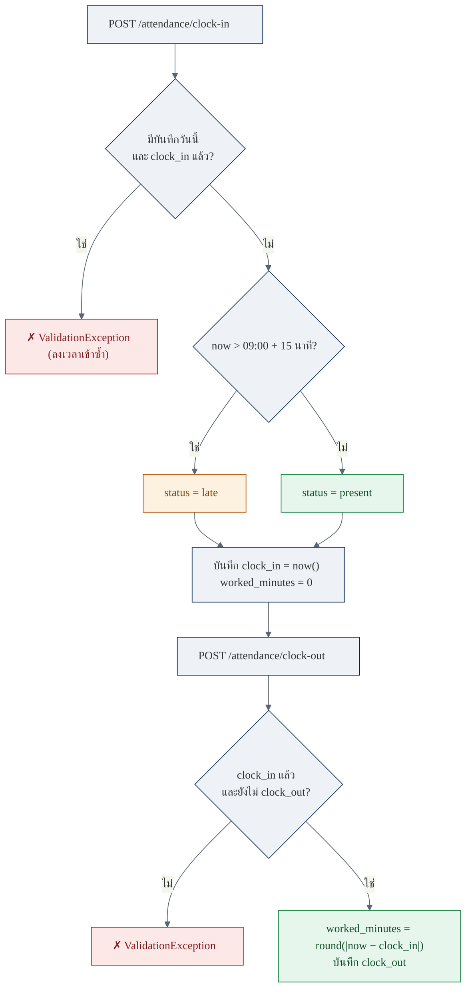

> เวลาเริ่มงาน/ระยะผ่อนผัน อ่านจาก `config('hrpro.work.start' = 09:00)` และ `late_grace_minutes = 15` · กันลงเวลาซ้ำด้วย unique index `(employee_id, work_date)` · สถานะที่นิยามไว้คือ `present/late/absent/half_day/on_leave` แต่ระบบลงเวลาตั้งค่าเฉพาะ `present` กับ `late`

---

## 7. แผนผังโมดูล & เส้นทาง (Module & Routing Map)

ทุกเส้นทางอยู่ในไฟล์เดียว `routes/web.php` (single source of truth) · เส้นทางแอปทั้งหมดอยู่ภายใต้กลุ่ม middleware `['auth', 'active']`

| โมดูล | เส้นทาง (ย่อ) | Controller | สิทธิ์ที่ต้องการ |
|---|---|---|---|
| **Authentication** | `GET/POST /login`, `POST /logout` | `Auth\AuthenticatedSessionController` | guest / auth |
| **Dashboard** | `GET /` | `DashboardController` | auth + active |
| **Profile** (self) | `GET/PUT /profile`, `/profile/password` | `ProfileController` | self-scoped |
| **Notifications** (self) | `/notifications`, `/{id}/read`, `/read-all` | `NotificationController` | self-scoped |
| **Employees** | `resource /employees` (CRUD) | `EmployeeController` | `employees.{view,create,update,delete}` |
| **Departments** | `resource /departments` (− show) | `DepartmentController` | `departments.*` |
| **Positions** | `resource /positions` (− show) | `PositionController` | `positions.*` |
| **Leave Types** | `resource /leave-types` (− show) | `LeaveTypeController` | `leave-types.*` |
| **Leave Requests** (self) | `index/create/store/show` + `/cancel` | `LeaveRequestController` | ownership ∥ `leave-requests.viewAll` |
| **Leave Approvals** | `/leave-approvals` + `/approve` `/reject` | `LeaveApprovalController` | `leave-approvals.{view,approve}` |
| **Attendance** | `/attendance` + `/clock-in` `/clock-out` | `AttendanceController` | self + `attendance.viewAll` |
| **Announcements** | `resource /announcements` (CRUD) | `AnnouncementController` | `announcements.manage` (index/show เปิดทุกคน) |
| **Reports** | `GET /reports` | `ReportController` | `reports.view` |
| **Audit Logs** | `GET /audit-logs` | `AuditLogController` | `audit-logs.view` |
| **Users** (Settings) | `resource settings/users` | `Settings\UserController` | `users.*` (ห้ามลบตัวเอง) |
| **Roles** (Settings) | `resource settings/roles` | `Settings\RoleController` | `roles.*` (ห้ามลบ role ระบบ) |

**เส้นทางสาธารณะ (Public):** `GET/POST /login` (guest), `GET /up` (health check) — *ที่เหลือต้อง `auth + active` ทั้งหมด*

---

## 8. ระบบดีไซน์ (Design System)

> **Hand-authored · Dependency-free · ธีมผ่าน CSS custom properties** — สไตล์ Corporate B2B HR admin: โทน navy–blue บนพื้นเทาอ่อนเย็นตา, การ์ดขาวเงานุ่ม, มุมโค้งพอเหมาะ, ไอคอนเส้นสไตล์ Feather

### 8.1 ชุดสี (Color Palette)

**สีแบรนด์ & Action**

| Swatch | Token | Hex | บทบาท |
|---|---|---|---|
|  | `--c-primary` | `#1e3a5f` | Corporate navy — sidebar, avatar, แบรนด์ |
|  | `--c-primary-700` | `#16304f` | Navy เข้มสุด — gradient เริ่ม |
|  | `--c-accent` | `#2563eb` | Action blue — ปุ่มหลัก, ลิงก์, nav active, focus ring |
|  | `--c-accent-700` | `#1d4ed8` | Action blue hover |

**สีพื้นผิว & ข้อความ**

| Swatch | Token | Hex | บทบาท |
|---|---|---|---|
|  | `--c-bg` | `#f4f6f9` | พื้นหลังหน้า (เทาเย็นอ่อน) |
|  | `--c-surface` | `#ffffff` | การ์ด/แผง/topbar |
|  | `--c-border` | `#e3e8ef` | เส้นขอบบาง |
|  | `--c-text` | `#1f2937` | ข้อความหลัก/หัวข้อ |
|  | `--c-text-soft` | `#5b6675` | ข้อความรอง/label |
|  | `--c-muted` | `#8a94a6` | ข้อความ tertiary/hint |

**สีสถานะ (Semantic)**

| Swatch | Token | Hex | บทบาท |
|---|---|---|---|
|  | `--c-success` | `#15803d` | สำเร็จ (เขียว) |
|  | `--c-warning` | `#b45309` | เตือน (อำพัน) |
|  | `--c-danger` | `#b91c1c` | อันตราย/ลบ (แดง) |
|  | `--c-info` | `#1e40af` | ข้อมูล (น้ำเงิน) |

**Avatar palette** (เลือกแบบ deterministic จาก `crc32(email) % 8`):


### 8.2 ตัวอักษร (Typography)

- **Font stack** (`--font`): `"Inter", "Segoe UI", "Noto Sans Thai", system-ui, …` — โหลด Inter + Noto Sans Thai จาก Google Fonts (น้ำหนัก 400/500/600/700)
- **Base:** `14px` / line-height `1.5` / antialiased · `lang="th"`
- **Type scale (px):** stat value 26·700 · auth heading 30 · page H1 22 · topbar 16 · card header 15 · body/input 14 · table 13.5 · nav link 13.5 · badge 11.5 · group label 10.5 (uppercase)
- **ตัวเลขแบบตาราง:** `font-variant-numeric: tabular-nums`

### 8.3 Spacing · Radius · Shadow

| โทเคน | ค่า | ใช้กับ |
|---|---|---|
| `--radius` | `10px` | การ์ด, stat tile, dropdown |
| `--radius-sm` | `7px` | ปุ่ม, input, nav link, alert, pagination |
| `--shadow-sm` | `0 1px 2-3px rgba(16,24,40,.06–.07)` | การ์ด, stat, active nav |
| `--shadow-md` | `0 4px 12px rgba(16,24,40,.08)` | dropdown menu |
| Focus ring | `0 0 0 3px rgba(37,99,235,.15)` | input/select/textarea ขณะ focus |

**Layout dims:** `--sidebar-w 252px` · topbar `60px` · `.content` max-width `1280px` (จัดกลาง) · paddings: content 24 / card-body 20 / stat 18

### 8.4 คลัง UI Components (Anonymous Blade)

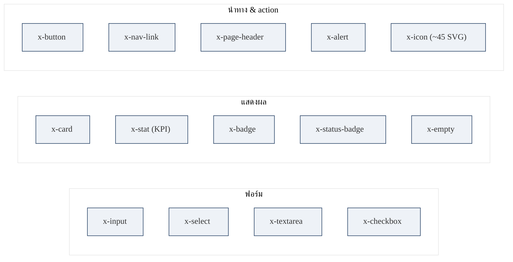

`x-status-badge` แปลง enum โดเมน (employee/employment/leave/attendance/announcement) เป็น `[สี, ป้ายภาษาไทย]` อัตโนมัติ · `x-icon` เป็นคลัง inline SVG ~45 ไอคอน สไตล์ Feather (stroke currentColor)

### 8.5 โครงร่างหน้า (App Shell) & Responsive

- **App shell** (`layouts/app.blade.php`): sidebar navy ซ้าย (252px, fixed, gradient) + `.main` (topbar 60px sticky + `.content`)
- **Sidebar:** จัดกลุ่มเมนูตามหัวข้อ (หน้าหลัก / บุคลากร / การลา & เวลางาน / องค์กร / ผู้ดูแลระบบ) พร้อม gating ด้วย `@can`
- **Topbar:** hamburger (มือถือ) · ชื่อหน้า · กระดิ่งแจ้งเตือน (จุดแดงเมื่อยังไม่อ่าน) · dropdown ผู้ใช้ (avatar + บทบาท)
- **Guest shell** (`layouts/guest.blade.php`): 2 คอลัมน์ — แผงการตลาด navy→accent ซ้าย + การ์ดล็อกอินขวา
- **Responsive (mobile-first, ไม่มี framework):** `1024px` sidebar กลายเป็น off-canvas + scrim · `980px` grid 2 คอลัมน์ยุบเดี่ยว · `860px` ซ่อนแผงการตลาด · `720px` form ยุบคอลัมน์เดียว
- **Interactivity** (`public/js/app.js`, vanilla IIFE): toggle sidebar, click-away dropdown, `data-confirm` ก่อนลบ, auto-dismiss flash 5 วินาที, นาฬิกาสด `#live-clock`
- **Dark mode:** ยังไม่มี (โครงสร้าง CSS variables พร้อมต่อยอด)

---

## 9. คุณภาพ & การทดสอบ (Quality & Testing)

ใช้ **PHPUnit** บน SQLite `:memory:` (กำหนดใน `phpunit.xml` — ไม่กระทบ MySQL จริง) · `composer test` → `php artisan test`

| ชุดทดสอบ | ประเภท | ครอบคลุม |
|---|---|---|
| `LeaveServiceTest` | Unit | นับวันทำงาน, จอง/คืน/ใช้ยอดวันลา, ทับซ้อน, ลาเกินสิทธิ์, auto-approve |
| `AttendanceServiceTest` | Unit | present/late ตาม grace, ลงเวลาซ้ำ, คำนวณ worked_minutes (480 → 8.0 ชม.) |
| `AuthTest` | Feature | เข้าสู่ระบบ/ออก, รหัสผิด, redirect guest, ตั้ง last_login_at |
| `LeaveRequestFlowTest` | Feature | e2e: ยื่น → pending → HR อนุมัติ → ยอดอัปเดต + แจ้งเตือน; 403 สำหรับ role employee |
| `EmployeeManagementTest` | Feature | CRUD พนักงาน + ตรวจ RBAC (super-admin ผ่าน, employee 403) |

**คุณภาพโค้ด:** Laravel Pint (code style) · Form Request validation รวมศูนย์ · Service layer แยกทดสอบได้ · *(ยังไม่มี CI workflow — ดู [§12](#12-แผนพัฒนาต่อ-roadmap))*

---

## 10. ประสิทธิภาพ (Performance)

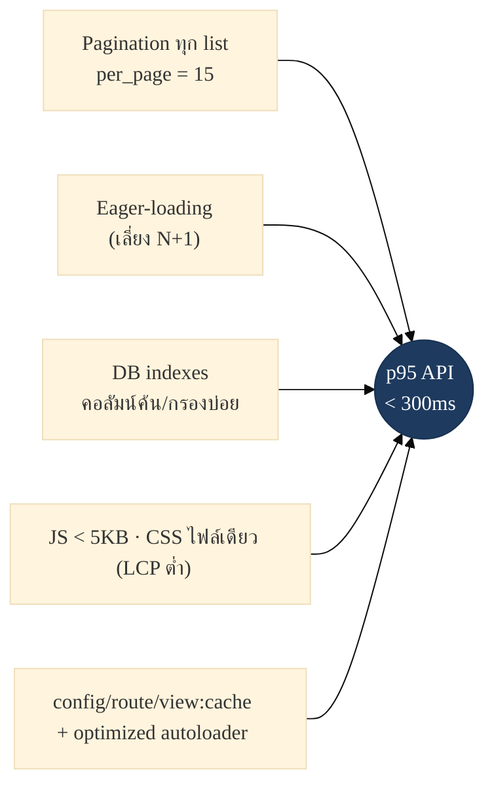

- ทุก list ใช้ pagination (`config('hrpro.per_page') = 15`) — ไม่โหลดเกิน ~50 แถว/หน้า
- Eager-loading ความสัมพันธ์เพื่อเลี่ยง N+1 (เช่น `EmployeeController@index` → `with(['department','position'])`)
- ดัชนีฐานข้อมูลครอบคลุมคอลัมน์ค้นหา/กรองบ่อย (status, dept, position, dates, composite)
- ไม่มี JS framework → bundle เล็ก, LCP ต่ำ
- Production cache config/route/view + optimized autoloader ตอน boot

---

## 11. การนำขึ้นใช้งาน (Deployment & DevOps)

### 11.1 Pipeline (Render · Docker + SQLite)

```mermaid
%%{init: {'theme':'base','themeVariables':{'primaryColor':'#eef2f7','primaryBorderColor':'#1e3a5f','lineColor':'#5b6675','fontFamily':'Inter, Noto Sans Thai, sans-serif'}}}%%
flowchart LR
  dev["git push<br/>(GitHub)"] --> rndr["Render<br/>autoDeploy · runtime docker"]
  rndr --> build["Docker build<br/>php:8.3-cli + pdo_sqlite/mbstring/zip<br/>composer install --no-dev"]
  build --> ep["entrypoint.sh"]
  subgraph steps["ขั้นตอน entrypoint (set -e)"]
    direction LR
    k["key:generate<br/>(ถ้าไม่มี)"] --> mig["migrate --force"] --> seed["db:seed<br/>(ครั้งแรก · sentinel)"] --> cache["config/route/view<br/>:cache"]
  end
  ep --> steps --> serve["artisan serve :8080"]
  serve --> live["🌐 hr-pro.onrender.com"]

  classDef brand fill:#1e3a5f,stroke:#16304f,color:#fff;
  classDef live fill:#0f766e,stroke:#0b5d57,color:#fff;
  class rndr,serve brand;
  class live live;
```

### 11.2 รายละเอียดสภาพแวดล้อม

| | Docker / Render (เดโม) | Production (self-hosted) |
|---|---|---|
| **Runtime** | `php:8.3-cli`, `artisan serve` | PHP 8.2+ + Nginx/Apache + PHP-FPM |
| **DB** | SQLite (`database.sqlite`) | MySQL 8 / MariaDB 10.6+ |
| **Drivers** | session=file, cache=file, queue=sync, log=stderr | ตามนโยบายองค์กร |
| **ENV สำคัญ** | APP_ENV=production, APP_DEBUG=false, APP_TIMEZONE=Asia/Bangkok | + `SESSION_SECURE_COOKIE=true` (หลัง HTTPS) |
| **Build/optimize** | ใน entrypoint | `composer install --no-dev --optimize-autoloader` + `config/route/view:cache` |
| **Document root** | — | `public/` |

> **ข้อจำกัด Free tier:** เซิร์ฟเวอร์ "หลับ" หลังว่าง ~15 นาที, ตื่นใหม่ ~30–60 วินาที · ข้อมูลตัวอย่าง seed ใหม่ทุก redeploy (เหมาะกับเดโม) · Docker image เดียวกันใช้กับ Koyeb/Fly.io/Railway ได้

---

## 12. แผนพัฒนาต่อ (Roadmap)

> **Feature Map** — MVP และ **Phase 2 (ส่งมอบครบแล้วใน v1.1)** โดยลูกศรสื่อว่าฟีเจอร์ Phase 2 ต่อยอดจากรากฐานใดของ MVP

### 12.1 ภาพรวม Feature Map

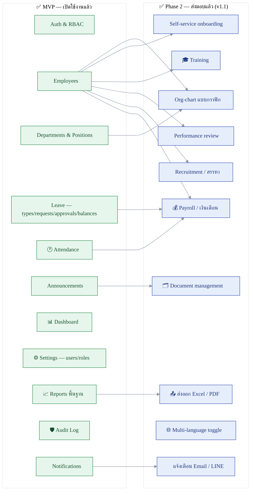

### 12.2 MVP — ส่งมอบแล้ว ✅

| โมดูล | ขอบเขตที่ส่งมอบ |
|---|---|
| 🔐 **Auth & RBAC** | Session login, throttle 5 ครั้ง/นาที, ระงับบัญชี, 4 บทบาท + 30+ permission, Gate กลาง |
| 👥 **Employees** | ทะเบียนประวัติ (CRUD), ค้นหา/กรอง, แบ่งหน้า, โปรไฟล์พร้อมยอดวันลา |
| 🏢 **Departments & Positions** | โครงสร้างองค์กร, หัวหน้าแผนก, ลำดับขั้น parent/children |
| 🌴 **Leave** | ประเภทการลา, ยื่นคำขอ (ตัดวันทำงานอัตโนมัติ), สายอนุมัติ, ยอดคงเหลือ (entitled/used/pending) |
| 🕐 **Attendance** | ลงเวลาเข้า–ออก, ตรวจมาสายตามเวลางาน, ประวัติการลงเวลา |
| 📣 **Announcements** | ประกาศพร้อมหมวดหมู่/ปักหมุด/สถานะเผยแพร่ |
| 📊 **Dashboard** | KPI การ์ดสรุป, จำนวนพนักงานแยกแผนก, คำขอลาล่าสุด, ประกาศ, พนักงานเข้าใหม่ |
| ⚙️ **Settings (users/roles)** | จัดการผู้ใช้ระบบ และบทบาท/สิทธิ์รายการ permission |
| 📈 **Reports พื้นฐาน** | สถิติกำลังพล/การลา/การลงเวลา |
| 🛡️ **Audit Log** | บันทึกการกระทำสำคัญ (login, สร้าง/อนุมัติ/ปฏิเสธ ฯลฯ) พร้อม IP/User-Agent |
| 🔔 **Notifications** | การแจ้งเตือนภายในระบบ (in-app) เช่น ผลการอนุมัติลา |

### 12.3 Phase 2 — ส่งมอบแล้ว ✅ (v1.1)

> ทุกฟีเจอร์ด้านล่างถูกพัฒนาและทดสอบแล้ว (PHPUnit 35 เทสต์ผ่านทั้งหมด) — ลำดับความสำคัญคือลำดับที่ใช้ระหว่างพัฒนา

| ฟีเจอร์ | ต่อยอดจาก (MVP) | ขอบเขตที่ส่งมอบ | ลำดับ* |
|---|---|---|:---:|
| 💰 **Payroll / เงินเดือน** | Employees · Leave · Attendance | คำนวณเงินเดือนจากฐานเงินเดือน + ขาด/ลา/สาย, สลิป | 🔴 สูง |
| 📤 **ส่งออก Excel / PDF** | Reports | ดาวน์โหลดรายงาน/ทะเบียนเป็นไฟล์ | 🔴 สูง |
| 📧 **แจ้งเตือน Email / LINE** | Notifications | เพิ่มช่องทางส่งออกนอกเหนือ in-app | 🔴 สูง |
| 🌳 **Org-chart แบบกราฟิก** | Departments · Positions · Employees | แผนผังองค์กรเชิงภาพจากข้อมูลที่มีอยู่ | 🟠 กลาง |
| 🧲 **Recruitment / สรรหา** | Employees | ประกาศรับสมัคร, ผู้สมัคร, สายสัมภาษณ์ | 🟠 กลาง |
| 🎯 **Performance review** | Employees | รอบประเมิน, แบบฟอร์ม, คะแนน/ฟีดแบ็ก | 🟠 กลาง |
| 🗂️ **Document management** | Announcements | คลังเอกสาร/นโยบาย, แนบไฟล์, เวอร์ชัน | 🟠 กลาง |
| 🚀 **Self-service onboarding** | Employees | พนักงานใหม่กรอก/อัปโหลดเอกสารเอง | 🟠 กลาง |
| 🎓 **Training** | Employees | หลักสูตร, การลงทะเบียน, ประวัติอบรม | 🟡 ต่ำ |
| 🌐 **Multi-language toggle** | ทั้งระบบ | สลับ ไทย/อังกฤษ (โครง CSS/locale พร้อมต่อยอด) | 🟡 ต่ำ |

<sub>*ลำดับความสำคัญเป็นข้อเสนอแนะตามคุณค่าทางธุรกิจและการต่อยอดจากรากฐานที่มี — ปรับได้ตามนโยบายองค์กร</sub>

### 12.4 Backlog เชิงเทคนิค 🔧

| รายการ | คำอธิบาย |
|---|---|
| CI workflow | GitHub Actions รัน `php artisan test` อัตโนมัติทุก push (ปัจจุบันยังไม่มี) |
| เพิ่ม test coverage | ขยาย Feature/Unit tests ให้ครอบคลุมโมดูลที่เหลือ |
| Dark mode | เพิ่มธีมมืดผ่าน CSS custom properties (โครงสร้างพร้อมแล้ว) |
| Public-holiday calendar | ให้วันหยุดนักขัตฤกษ์มีผลกับการนับวันลา (ปัจจุบันนับเฉพาะ จ.–ศ.) |
| ext-intl ใน prod | เปิด `intl` เพื่อรองรับ locale ไทยเต็มรูปแบบ (Faker/Transliterator) |

---

## 13. ภาคผนวก (Appendix)

### 13.1 อ้างอิงคอนฟิกโดเมน (`config/hrpro.php`)

| คีย์ | ค่าเริ่มต้น | ความหมาย |
|---|---|---|
| `company_name` | `HR PRO Co., Ltd.` | ชื่อบริษัทที่แสดง |
| `work.start` / `work.end` | `09:00` / `18:00` | เวลาเข้า–ออกงาน |
| `work.late_grace_minutes` | `15` | ระยะผ่อนผันก่อนนับสาย |
| `work.working_days` | `[1,2,3,4,5]` | วันทำงาน (ISO จ.–ศ.) |
| `leave_year_start_month` | `1` | เดือนเริ่มปีวันลา |
| `per_page` | `15` | ขนาดหน้าเริ่มต้น |
| `employee_code` | `EMP-` + pad 4 | รูปแบบรหัสพนักงาน |

### 13.2 Helper functions (`app/Support/helpers.php`)

- `initials(?string)` — ตัวอักษรย่อชื่อ (สูงสุด 2 ตัว)
- `thb(int|float|null)` — จัดรูปแบบเงินบาท (`฿` + number_format)
- `avatar_color(?string)` — เลือกสี avatar แบบ deterministic จาก 8 สี (`crc32(seed) % 8`)

### 13.3 อภิธานศัพท์ (Glossary)

| คำ | ความหมาย |
|---|---|
| **RBAC** | Role-Based Access Control — กำหนดสิทธิ์ผ่านบทบาท |
| **HRIS** | Human Resource Information System |
| **Soft delete** | ลบเชิงตรรกะ (ตั้ง `deleted_at`) เพื่อกู้คืน/รักษาประวัติ |
| **Gate::before** | hook ของ Laravel ที่รันก่อนการตรวจสิทธิ์ทุกครั้ง |
| **Error envelope** | รูปแบบ JSON ตอบกลับข้อผิดพลาดที่เป็นมาตรฐานเดียวกัน |
| **HasMiddleware** | interface ที่ Controller ใช้ประกาศ middleware ของตน |

### 13.4 หมายเหตุเรื่องเครื่องมือไดอะแกรม

แผนภาพทั้งหมดในเอกสารนี้เขียนด้วย **Mermaid** เพราะ:
1. **ฟรีและโอเพนซอร์ส** (MIT) — ไม่มีค่าใช้จ่าย ไม่มี vendor lock-in
2. **เรนเดอร์เป็นภาพอัตโนมัติ** บน GitHub, GitLab, VS Code (ผ่านส่วนขยาย) และ static site ทั่วไป โดยไม่ต้องแนบไฟล์รูป
3. **เก็บเป็นข้อความใน Git** — ดู diff ได้, รีวิวง่าย, แก้ไขด้วย editor ใด ๆ
4. **ไม่ต้องมี build step** — สอดคล้องกับปรัชญาของโปรเจกต์

หากต้องการส่งออกเป็นรูป (PNG/SVG) สามารถใช้ [Mermaid Live Editor](https://mermaid.live) หรือ `@mermaid-js/mermaid-cli` ได้

<div align="center">

---

<sub>HR PRO · System Design Document v1.0 · ปรับปรุง 21 มิ.ย. 2026 · เขียนด้วย ❤️ และ Mermaid</sub>

</div>
